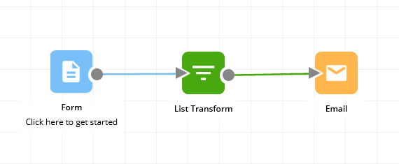
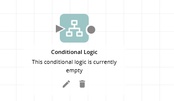
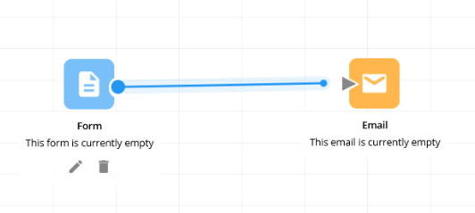
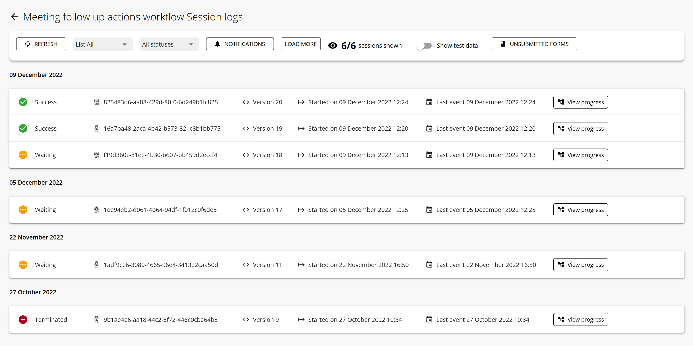
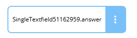

## Workflow

A workflow is a sequence of tasks through which work goes from start to finish. In Workflow86, a workflow is a combination of components connected together with each component perform a task and then handing its output to other components to do their task until the overall work is completed.

Read more ➡ <a href="#">here</a>

## Component

A component is an application that performs a particular task. A component may receive inputs from other components, and then produce outputs for other components.

Read more ➡ <a href="#">here</a>

## Connection

A connection links one component to another, passing information and data from the first component to subsequent components in the workflow.

Read more ➡ <a href="#">here</a>

## Session

A session is a specific instance of a workflow being started and run. Whenever you run a workflow, you start a workflow session.

Read more ➡ <a href="#">here</a>

## Placeholder

A placeholder is a reference, variable or representation of a value, answer, result or output. For example "age_answer" can be a placeholder for the answer to the question "what is your age". When the user answers "28" to the question, "age_answer" has the value "28".

Read more ➡ <a href="#">here</a>

## Other useful terms

These terms aren't essential, but you might find these terms useful when using Workflow86.

### Development

Development basically describes everything before the workflow goes live or is launched into the real world. It can also be referred to as the Draft state of a workflow. When you are building a workflow on the canvas, you are in development. The stage after development is production.

### Production

Production is the live or launched state of a workflow - it means the workflow is out in the real world, being used. When you publish a workflow, it goes into production.
