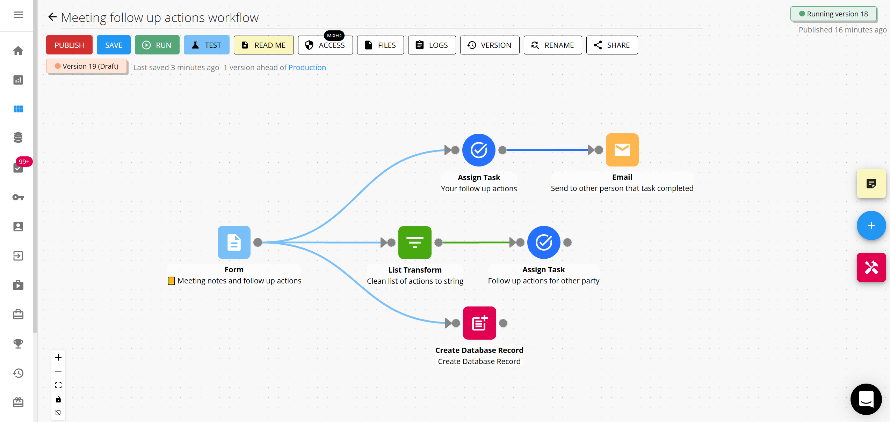

## What is Workflow86

Workflow86 is a no-code automation platform that allows users to create custom workflows and processes using drag and drop components. It allows users to build more of their workflow in one place, minimizing external dependencies to create more powerful and reliable workflow automation while still having the flexibility to integrate when needed.

## First time using Workflow86?

Jump straight to our getting started guide to run your first workflow and then edit your first workflow in **10 minutes**.

<Card
  title="Get started now"
  icon="rocket-launch"
  icontype="duotone"
  href="/docs/getting-started/run-first-workflow"
></Card>

## How do I use this component?

Workflow86 has a range of components to build your workflow, and you can find detailed guides for how to use each component right 👉 <a href="">here</a> 👈

## Need 1:1 help?

You can book in a 1:1 session with our team to help you with anything to do with Workflow86. This includes troubleshooting issues, brainstorming ideas for workflows, or suggesting improvements for workflows you have already created yourself.

<Card
  title="Book a 1:1 session now"
  icon="headset"
  icontype="duotone"
  href="https://calendly.com/aaron-workflow86/meeting"
></Card>

## Further support

For further support, contact support@workflow86.com or use the live chat feature on our platform.